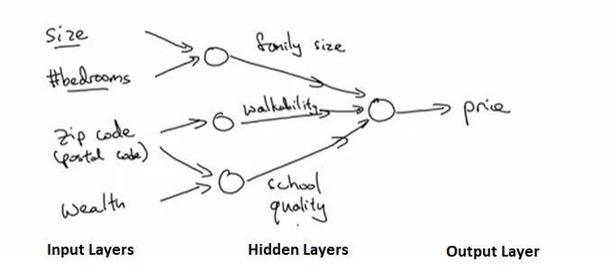
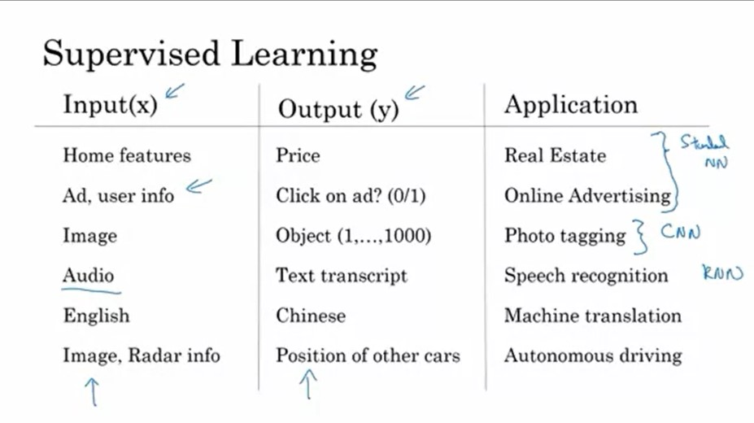
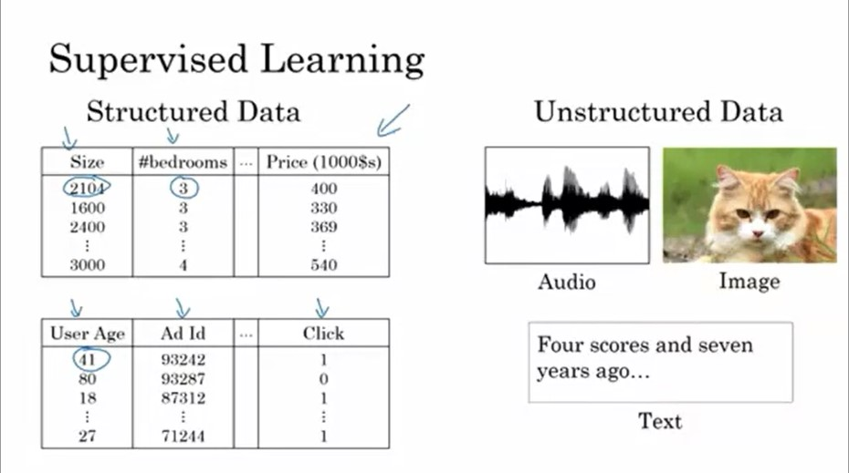
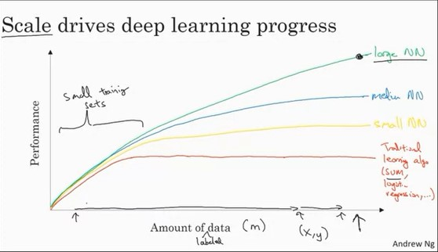

## Week 1 - Introduction

- Deep Learning refers to the training of very large neural networks

### What is a Neural Network?

- A neural network comprises of neurons which simply take the input, computes the function and returns the output.
- **Input Layers** provide the basic features that are obvious to the particular problem or use-case.
- **Hidden Layers** are present to identify the essential and hidden features in the particular input and vary their weightage to influence the output.
- **Output Layer** give the final prediction or value required from the neural network.

- Given enough training examples, neural networks are remarkably good at figuring out functions that accurately map from input X to output Y, which are great for supervised learning incentives.

---

### Supervised Learning with Neural Networks

- Supervised Learning is usually characterised with having a input X and an output Y and the the objective is to learn the function mapping from X to Y.
- Examples
  - Real Estate Price Prediction (Regression based task)
  - Ads: User clicks or not (Classification based task)
  - Image Tagging (Multi-Class Classification)
  - Speech Recognition
  - Machine Translation
  - Autonomous Driving

- Supervised learning can be applied to both structured and unstructured data.

---

### Why is Deep Learning taking off?

- Ideas for neural networks and depp learning have been lying around for decades.
- Scale drives deep learning progress i.e. more data, better accuracy.
- Traditional learning algorithms hit a plateau even when more data is provided.
- In the digital age, users are generating more than enough data.
- Neural networks get better with more amount of data.

- The usability/viability of the neural networks heavily depend on
  - Data
  - Computation Time
  - Algorithms
- Neural networks are iterative in terms of construction. they go through a phase of ideation, coding and experimentation in order to build an effective neural network.
